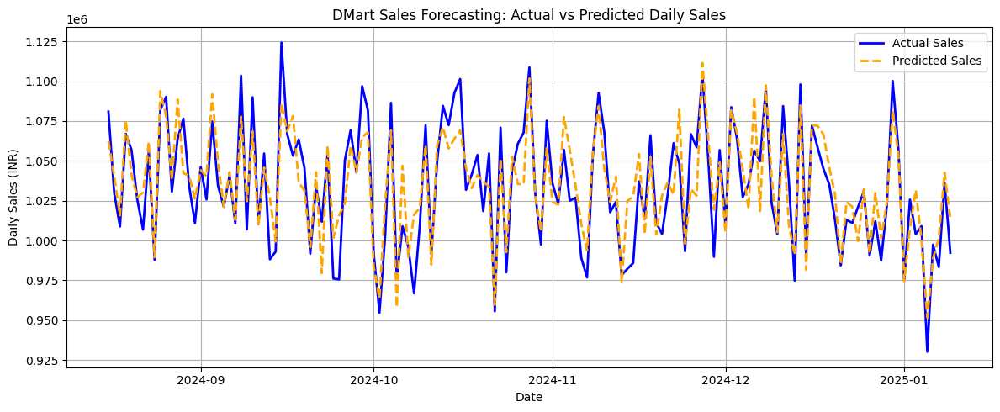

# DMart Daily Sales Forecasting using Machine Learning

A machine learning project designed to forecast daily sales trends from retail transaction data using time-series feature extraction and an ensemble Random Forest Regressor.
 📌 Project Overview
Accurate demand forecasting enables retail chains like DMart to optimize inventory replenishment, prevent stock-outs, and minimize carrying costs. This project processes transactional records, aggregates daily sales volume, engineers calendar and historical lag features, and evaluates predictive accuracy on unseen test data.

🛠️ Tech Stack
Language: Python 3.x

Data Processing: Pandas, NumPy

Machine Learning: Scikit-Learn (RandomForestRegressor)

Visualization: Matplotlib

 ⚙️ Methodology & Pipeline
1. Data Preprocessing & Cleaning
Extracted clean timestamps and filtered non-numeric/null records.

Dropped non-predictive identifiers (FullName).

Aggregated transaction records into chronological daily totals (DailySales and TotalUnits).

2. Feature Engineering
Calendar Features: Day, Month, Year, Day of Week, Weekend indicator (IsWeekend).

Lag Features: 1-day prior sales (Sales_Lag1) and 7-day prior sales (Sales_Lag7) to capture weekly seasonality.

3. Train-Test Split
Temporal split (80% training, 20% testing) to preserve chronological sequence without future data leakage.

4. Model Architecture
Algorithm: Random Forest Regressor (100 estimators, random state = 42).

## 📊 Results & Performance Metrics

| Metric | Score |
| :--- | :--- |
| **R² Score (Coefficient of Determination)** | **0.7613** |
| **Mean Absolute Error (MAE)** | **15,186.94** |
| **Root Mean Squared Error (RMSE)** | **18,637.31** |

###Actual vs. Predicted Sales Curve

 🚀 How to Run
 
Clone this repository or open sales_forecast_dmart.ipynb.

Launch in Google Colab or local Jupyter Notebook.

Upload DMart_sample_data.csv and run all cells sequentially.
